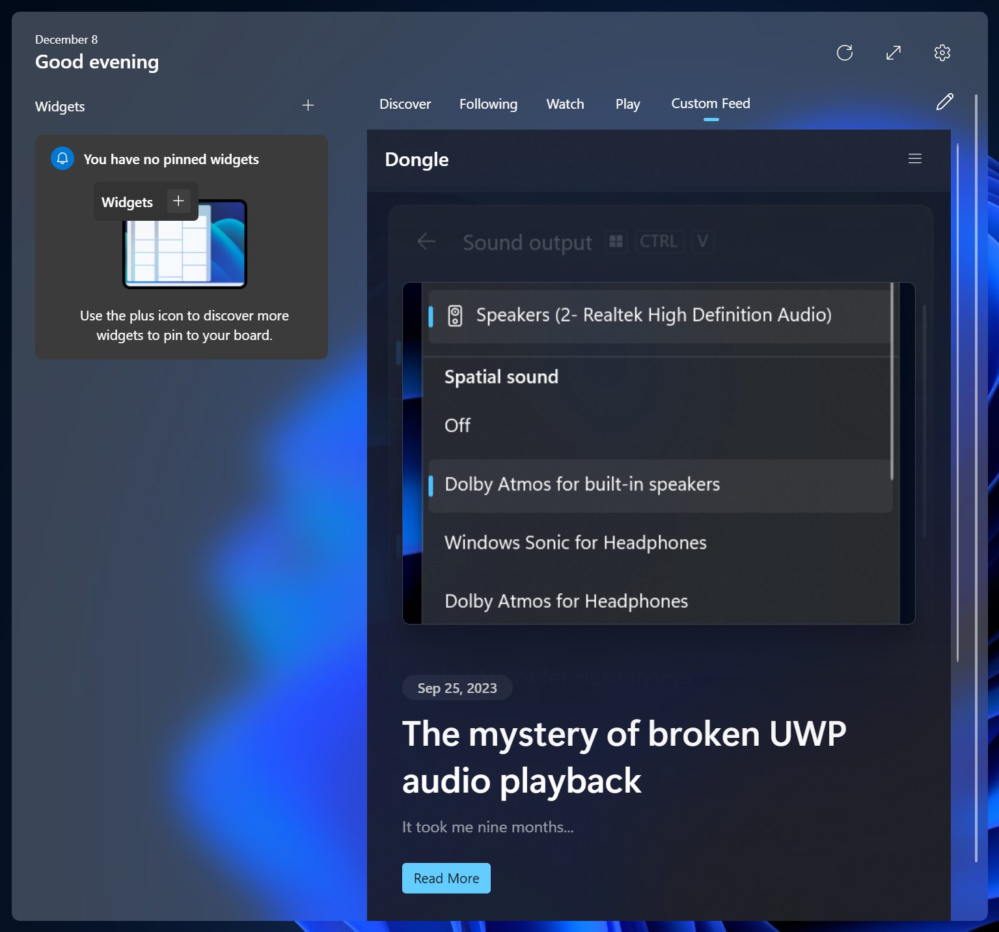

# CustomFeedProvider

A proof-of-concept for custom feeds in Windows Widgets.

## Requirements
### Enabling the feature
- Velocity IDs 44353396 and 45393399 enabled.
- Device region must be a country within the European Economic Area.
  - To change your region, follow [this tutorial](https://www.neowin.net/guides/how-to-remove-microsoft-edge-from-windows-11-in-the-latest-eea-compliant-update/).
### Building the POC
- Visual Studio 2022 with the "Desktop development with C++" and "Universal Windows Platform development" workloads installed.
- Windows SDK version 22621
- [Windows App SDK 1.5 Experimental 1 framework package](docs/resources/MSIX) installed.